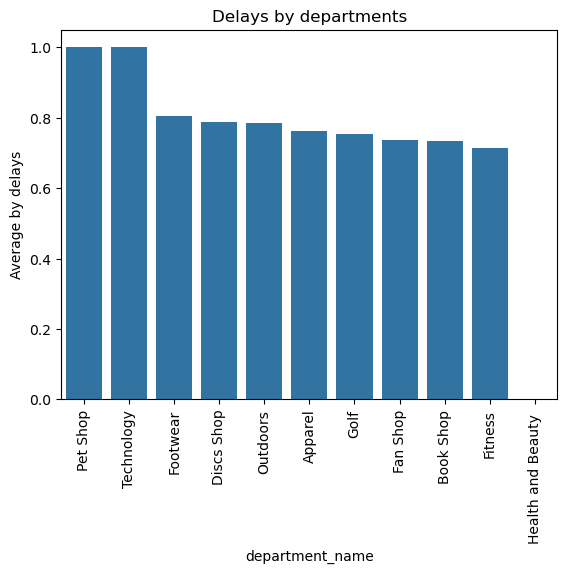
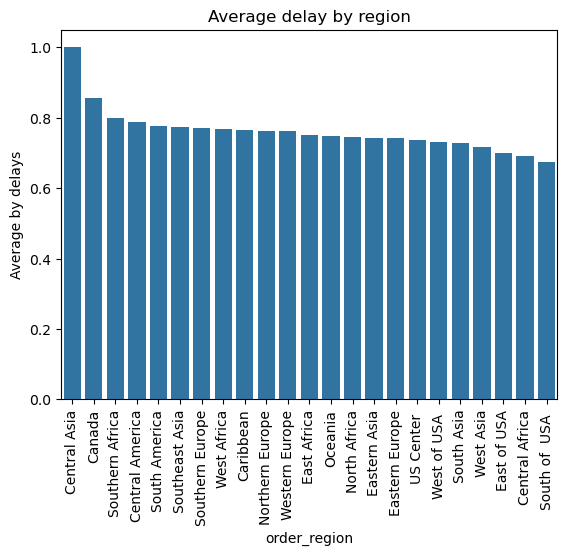
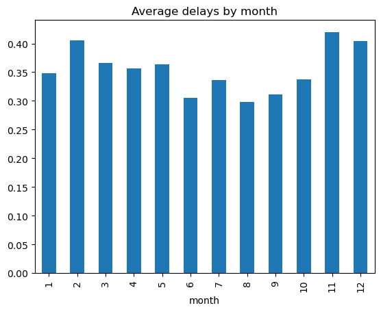
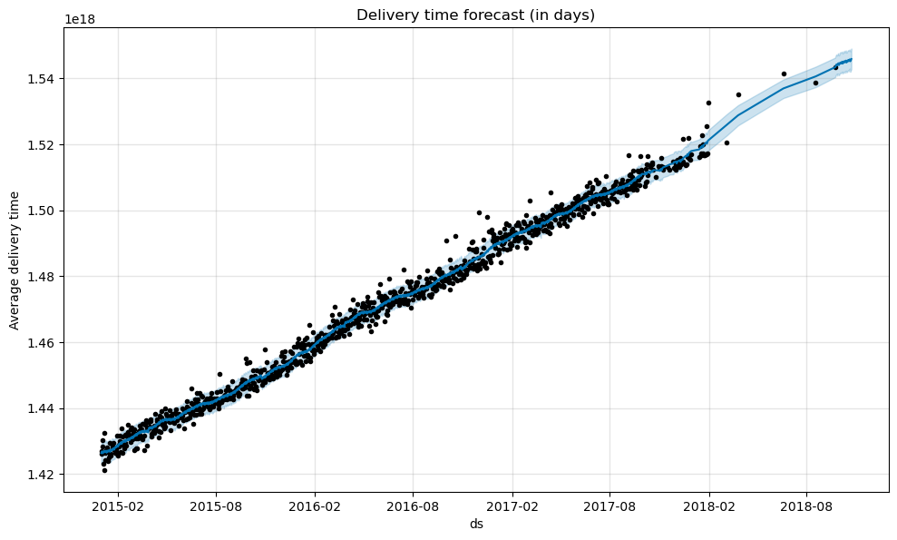

## 🚚 Optimization-of-delivery-times-and-logistics-analysis

#### 🧾 Dataset used: "incom2024_delay_example_dataset" from Kaggle.

#### 📖 Objective
Understand which regions are experiencing delivery issues, what factors influence delays, and how to reduce them.

---

#### 🛠️ Tools & Technologies
- Python (Pandas, Numpy, Matplotlib, Seaborn)
- ANOVA, XGBoost, Prophet
- Jupyter Notebook

---

#### 🔎 Key Insights
- The highest delivery delays are observed in Central Asia, Canada, and Southern Africa.
- Products in Strength Training, Computers, Music, Camping & Hiking and Pet Supplies have the highest probability of delays (above 70%). These are typically heavier or bulky items.
- Pet Shop and Technology departments are the least reliable, with the highest average delay scores. Excluding them reduces delay probability by only 0.08%, meaning the issue is systemic, not isolated.
- Delay rates peak in February, November, and December, likely due to holiday traffic and demand spikes.
- An ANOVA test confirms that shipping mode has a statistically significant impact on delays (p-value < 0.001), with Standard Class showing the highest risk.
- XGBoost model achieved 75% accuracy in predicting delivery delays.
- Prophet model forecasts a 20% increase in average delivery time in the next 30 days, indicating worsening trends if not addressed.

---

#### 💡 Recommendations
- Central Asia, Canada, and Southern Africa require immediate attention.
- Consider setting up regional micro-warehouses or local last-mile partners to reduce transit time by up to 35–45%.
- For high-delay categories, restructure stock allocation: store heavy/bulky items closer to demand clusters.
- Partner with specialized carriers for categories like computers or gym equipment.
- Review operations in Pet Shop and Technology departments.
- Reevaluate partnerships with current vendors and assess their SLA adherence.
- Implement weekly KPI dashboards to monitor fulfillment and delivery times.
- Based on statistical results, revisit default shipping methods.
- Offer priority shipping for problematic items or regions with conditional free upgrades.
- Collect and integrate courier company performance data — this will allow finer attribution of delay causes and better accountability.

---

#### 📸 Visualizations

#### 👨💻 About Me

Hi, my name is Zhasulan Agybay and this is my second data analysis project. Check out my other projects on [GitHub](https://github.com/Zhasulan-Agybay).

#### ⚖️ License
This project is licensed under the MIT License. See the [LICENSE](./LICENSE) file for details.
